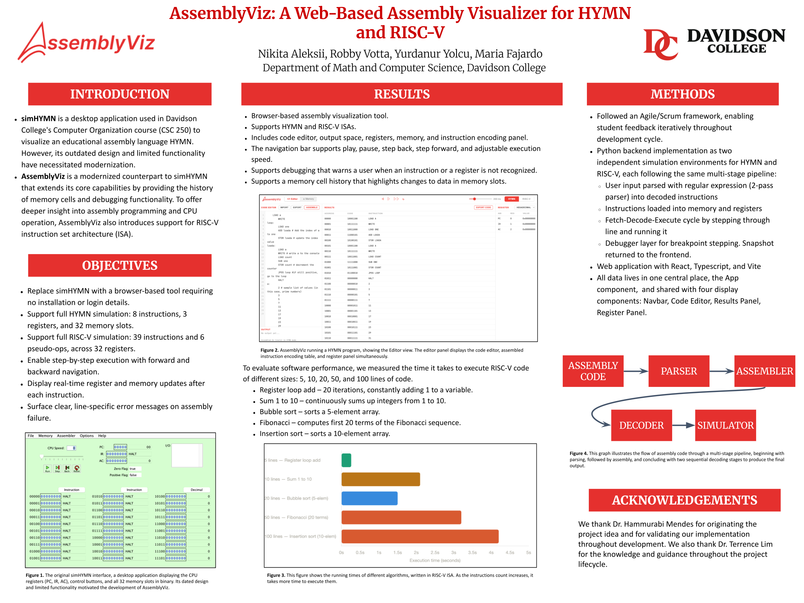

# AssemblyViz - Group 1

## Team Members

- **Nikita Aleksii** - Scrum Master + Developer
- **Maria Fajardo** - Product Owner + Developer
- **Robby Votta** - Developer
- **Yurdanur Yolcu** - Developer

---

## What is it



A web-based visualizer for assembly language execution. Supports two architectures - a simple 8-bit educational CPU (HYMN) and the full 32-bit RISC-V base integer instruction set (RV32I). Both backends share the same design philosophy: parse, assemble, and simulate step by step so the frontend can visualize register and memory state at each instruction.

---

## Repository Structure

```
AssemblyViz/
├── backend/
│   ├── __init__.py
│   ├── main.py              # FastAPI app — all HTTP endpoints
│   ├── hymn/               # 8-bit HYMN CPU simulator
│   │   ├── tests/
│   │   │   ├── step_sumn.py
│   │   │   ├── test_debugger.py
│   │   │   ├── test_executor.py
│   │   │   ├── test_instructions.py
│   │   │   ├── test_machine.py
│   │   │   └── test_parser.py
│   │   ├── __init__.py
│   │   ├── instructions.py
│   │   ├── parser.py
│   │   ├── machine.py
│   │   ├── executor.py
│   │   └── debugger.py
│   └── riscv/              # 32-bit RISC-V RV32I simulator
│       ├── tests/
│       │   ├── __init__.py
│       │   ├── assembler_test.py
│       │   ├── decoder_test.py
│       │   ├── memory_test.py
│       │   ├── merge_sort.S
│       │   ├── parser_test.py
│       │   └── simulation_test.py
│       ├── __init__.py
│       ├── isa.py
│       ├── parser.py
│       ├── assembler.py
│       ├── decoder.py
│       ├── memory.py
│       ├── registers.py
│       └── simulation.py
└── frontend/
    ├── index.html
    └── src/
        ├── assets/
        │   ├── backwards.svg
        │   ├── forward.svg
        │   ├── logo.svg
        │   ├── play.svg
        │   └── reset.svg
        ├── components/
        │   ├── CodeEditor.tsx    # Assembly source editor, input queue, import/export
        │   ├── ErrorBoundary.tsx # React error boundary wrapping the app
        │   ├── MemoryPanel.tsx   # Memory state viewer
        │   ├── Navbar.tsx        # Top bar with playback controls and ISA toggle
        │   ├── RegisterPanel.tsx # Register state viewer
        │   └── ResultsPanel.tsx  # Assembled instruction listing
        ├── types/
        │   └── index.ts          # Shared TypeScript interfaces
        ├── App.css               # All component styles
        ├── App.tsx               # Root component — owns all simulation state
        ├── index.css
        └── main.tsx              # React entry point
```

---

## Requirements

- Python 3.10 or higher
- No external Python dependencies — uses the standard library only, plus `fastapi` and `uvicorn`
- Node.js 18 or higher
- npm

---

## Running the Project

**Backend** (from the `backend/` directory):

```bash
pip install -r requirements.txt
uvicorn main:app --reload
```

Runs on `http://localhost:8000`.

**Frontend** (from the `frontend/` directory):

```bash
npm install
npm run dev
```

Runs on `http://localhost:5173`. API calls are proxied to the backend.

---

## Instruction Set Architectures (ISA)

### HYMN

HYMN is a minimal 8-bit CPU designed for teaching. It has 3 registers (PC, AC, IR) plus Zero Flag and Positive Flag status indicators derived from AC, 32 bytes of memory, and 8 instructions encoded in a single byte each. Programs are assembled from a simple mnemonic language and executed instruction by instruction. Also supports two pseudo-ops: `READ` (read an integer from the I/O console) and `WRITE` (write AC to the console).

See [`backend/hymn/README.md`](backend/hymn/README.md) for the full instruction set, architecture details, and usage examples.

### RISC-V (RV32I)

The RISC-V backend implements the full RV32I base integer instruction set. Source code goes through a two-pass parser that validates mnemonics, operands, and labels, then an assembler that encodes each instruction into a 32-bit machine word, and finally a step-through simulator that models memory, registers, and the fetch-decode-execute cycle.

See [`backend/riscv/README.md`](backend/riscv/README.md) for the full instruction set, pipeline, API reference, and usage examples.

---

## Design

Both backends follow the same layered structure:

- **Parser** — validates source text and builds a symbol table
- **Assembler / Executor** — encodes instructions into machine words
- **Simulator** — runs the fetch-decode-execute cycle step by step
- **Snapshot** — returns a JSON-serializable state dict after each step for the frontend to consume

The backend is **stateless**: machine state is fully reconstructed from the data sent by the frontend on every request.
