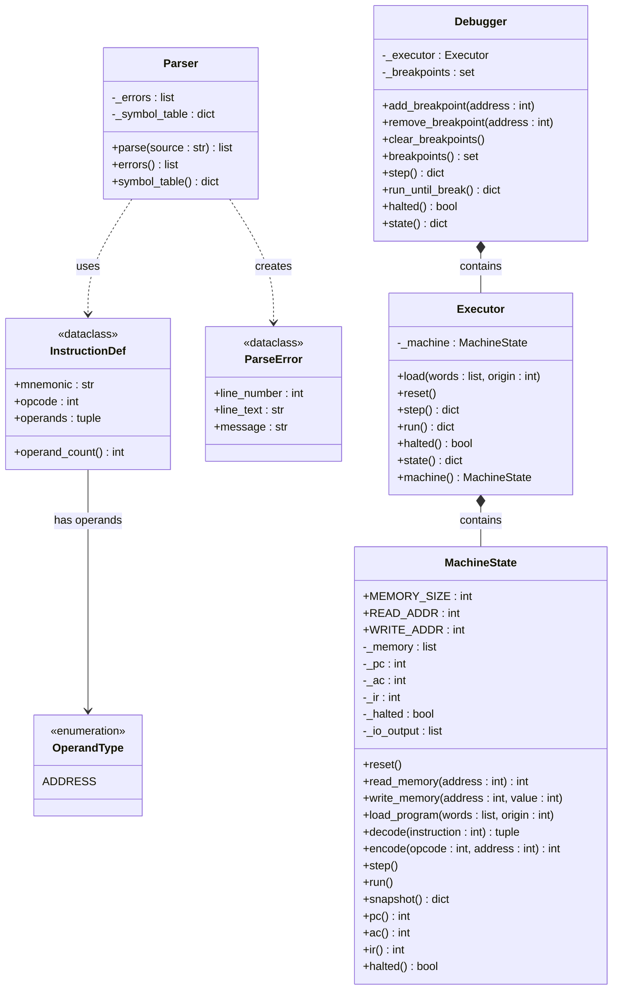

# HYMN — UML Class Diagram

## Notes

| Symbol | Meaning |
|--------|---------|
| `*--`  | Composition (owner controls lifetime) |
| `-->`  | Association |
| `..>`  | Dependency (uses transiently) |
| `+`    | Public |
| `-`    | Private |

**Instruction word format (8-bit):** `[opcode (3 bits) | address (5 bits)]`

**Data flow:** Source code → `Parser.parse()` → `list[int]` → `Executor.load()` → `MachineState` → `Executor.step()/run()` → snapshot `dict`
