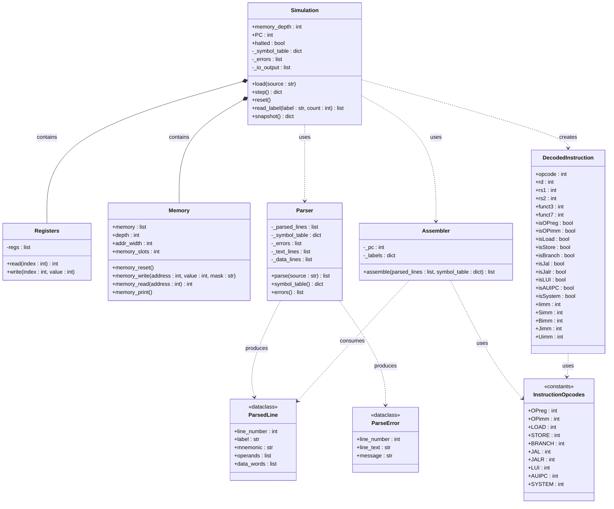

# RISC-V — UML Class Diagram

## Notes

| Symbol | Meaning |
|--------|---------|
| `*--`  | Composition (owner controls lifetime) |
| `..>`  | Dependency (uses transiently) |
| `+`    | Public |
| `-`    | Private |

**Instruction encoding formats:** R · I · S · B · U · J (all 32-bit words)

**Data flow:** Source code → `Parser.parse()` → `list[ParsedLine]` + symbol table → `Assembler.assemble()` → `list[int]` (32-bit words) → `Memory` → fetch/decode via `DecodedInstruction` → `Simulation._execute()`
