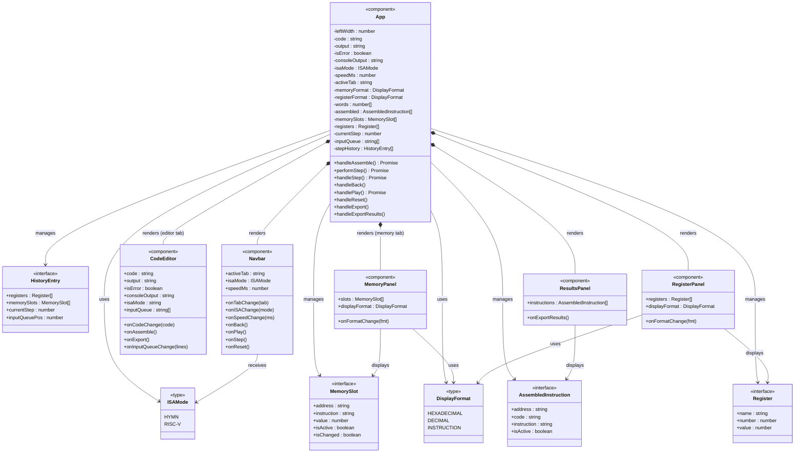

# Frontend — UML Class Diagram

## Notes

| Symbol | Meaning |
|--------|---------|
| `*--`  | Composition (App renders and owns child) |
| `-->`  | Dependency (receives / uses type) |
| `+`    | Prop (public input) |
| `-`    | State (internal to App) |

**Architecture:** All state lives in `App` and flows down as props. Every child component is fully controlled — no local state. Communication back to `App` is via callback props (`onXxx`).

**API calls** (made by `App` only):
- `POST /api/{hymn|riscv}/assemble` — triggered by `handleAssemble()`
- `POST /api/hymn/step` — stateful; passes `{ memory, pc, ac, io_input }`
- `POST /api/riscv/step` — stateless replay; passes `{ source, step_count }`
